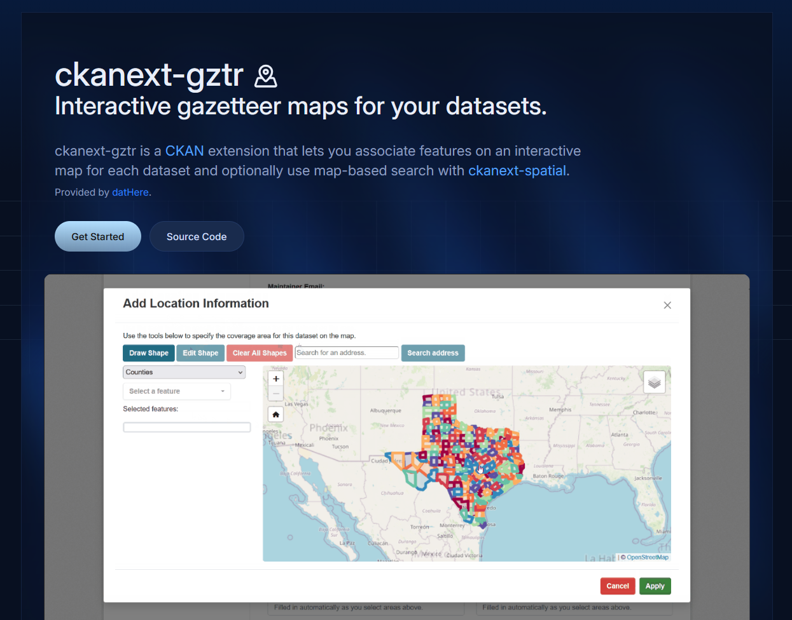

# ckanext-gztr docs web app (gztr.dathere.com)



This directory includes a Next.js project built with [Fumadocs](https://github.com/fuma-nama/fumadocs) for documentation of ckanext-gztr. The documentation can be viewed at [gztr.dathere.com](https://gztr.dathere.com).

## Generate the OpenAPI pages

Make sure you are in the `docs` root directory, then run (with pnpm installed and development packages installed including `tsx`):

```bash
pnpm tsx ./scripts/generate-api-reference.ts
```

Replace the content in `docs/content/docs/api-reference/meta.json` with:

```json
{
  "title": "API reference",
  "icon": "Globe",
  "pages": ["---STAC---", "...stac", "---Action API---", "...action-api"]
}
```

Then fix the spaces between capital letters in:

- `docs/content/docs/api-reference/stac/meta.json`
- `docs/content/docs/api-reference/action-api/meta.json`


## Development

Run development server with [pnpm](https://pnpm.io):

```bash
pnpm i
pnpm dev
```

Open http://localhost:3000 with your browser to see the result.

## Explore

In the project, you can see:

- `lib/source.ts`: Code for content source adapter, `loader()` provides the interface to access your content.
- `lib/layout.shared.tsx`: Shared options for layouts, optional but preferred to keep.

| Route                     | Description                                            |
| ------------------------- | ------------------------------------------------------ |
| `app/(home)`              | The route group for your landing page and other pages. |
| `app/docs`                | The documentation layout and pages.                    |
| `app/api/search/route.ts` | The Route Handler for search.                          |

## Linting

We use [Biome](https://biomejs.dev) for linting. We recommend you install the [biome-vscode extension](https://github.com/biomejs/biome-vscode) if you are using [VSCodium](https://vscodium.com/) or VSCode for developing the docs.
